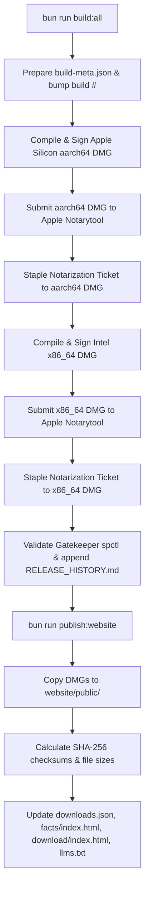

# Mynah macOS Production Build, Notarization & Publishing Guide

This document outlines the exact, step-by-step process required to compile, code-sign with Developer ID, notarize with Apple, staple, and publish the end-product DMGs to `mynah.site`.

---

## 1. Prerequisites Checklist

Before triggering a release build, ensure:

1. **Apple Developer ID Certificate**: Installed in your macOS Keychain.
   - Identity: `Developer ID Application: Khalid Irfan (99YAK7YU3M)`
   - Verify with:
     ```bash
     security find-identity -v -p codesigning
     ```
2. **Apple App-Specific Password**:
   - Generated from [appleid.apple.com](https://appleid.apple.com) under **Sign-In and Security > App-Specific Passwords**.
   - Associated with Apple ID: `irfan1476@gmail.com` (Team ID: `99YAK7YU3M`).
3. **Rust macOS Cross-Compilation Targets**:
   - Both Apple Silicon and Intel targets must be installed:
     ```bash
     rustup target add aarch64-apple-darwin x86_64-apple-darwin
     ```
4. **Website Repository**:
   - Cloned locally at `/Users/irfan/projects/Mynah/website`.

---

## 2. What the Automated Pipeline Does

The release scripts automate the entire packaging and publishing pipeline:



---

## 3. End-to-End Execution Steps

### Step 1: Run the Automated DMG Build & Notarization
Navigate to `apps/speakpaste`:
```bash
cd /Users/irfan/projects/SpeakPaste/speakpaste/apps/speakpaste
bun run build:all
```

**Prompts you will see during execution:**
1. **`Enter Apple App-Specific Password:`**
   - Type or paste your Apple App-Specific password (e.g. `xxxx-xxxx-xxxx-xxxx`). The input will be masked for security.
2. **`Enter a description of changes/fixes for this build:`**
   - Provide a short summary of changes (e.g. `Drop TTFA to <5ms with warm CoreAudio stream, 300ms pre-roll buffer, and capture sync fix`).

The script will now:
- Compile release binaries for both `aarch64` and `x86_64`.
- Bundle them into DMGs:
  - `dist/Mynah_1.0.0_b<build>_macos_aarch64.dmg`
  - `dist/Mynah_1.0.0_b<build>_macos_x86_64.dmg`
- Sign all binaries and app bundles with your Developer ID.
- Submit both DMGs to Apple's notarization servers and wait for validation (`xcrun notarytool submit --wait`).
- Staple the notarization ticket (`xcrun stapler staple`).
- Verify Gatekeeper compliance via `spctl -a -vv -t exec`.
- Record the output and SHA-256 hashes into `RELEASE_HISTORY.md`.

---

### Step 2: Sync Artifacts to the Website
Once `bun run build:all` finishes, publish the artifacts and update website metadata:
```bash
bun run publish:website
```

This automatically:
- Cleans previous DMGs from `/Users/irfan/projects/Mynah/website/public/`.
- Copies the freshly built and stapled DMGs to `website/public/`.
- Updates `/Users/irfan/projects/Mynah/website/downloads.json` with the new version, build number, file sizes, and SHA-256 checksums.
- Updates the download buttons and checksum labels in `/Users/irfan/projects/Mynah/website/download/index.html`.
- Updates the trust facts table in `/Users/irfan/projects/Mynah/website/facts/index.html`.
- Updates `/Users/irfan/projects/Mynah/website/llms.txt`.

---

### Step 3: Deploy the Website
Navigate to the website directory, review changes, commit, and push:
```bash
cd /Users/irfan/projects/Mynah/website
git status
git add .
git commit -m "release: deploy Mynah 1.0.0 build <build> with new TTFA performance benchmarks"
git push origin main
```

---

## 4. Local Testing Without Full Notarization (Dev / Fast Verification)

If you just want to compile a local release binary or local DMG without waiting for Apple notarization:

- **Build local release app**:
  ```bash
  bun run build
  bun run tauri build
  ```
  The app bundle will be placed at:
  `src-tauri/target/release/bundle/macos/Mynah.app`

- **Run in development mode with live reload**:
  ```bash
  bun run dev
  ```
