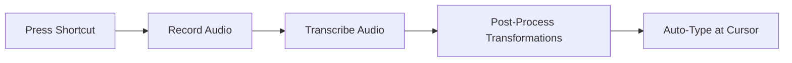

# SpeakPaste User Guide & Troubleshooting Manual

Welcome to the official **SpeakPaste** User Guide. This comprehensive guide covers everything from the initial installation and first-time configuration to advanced text post-processing pipelines and system troubleshooting.

SpeakPaste is designed for professionals, writers, developers, and power users who want a lightning-fast, privacy-first, and system-wide voice typing utility. 

---

## Table of Contents
1. [Product Overview](#1-product-overview)
2. [Quick Start & First Launch](#2-quick-start--first-launch)
3. [Recording Modes & Methods](#3-recording-modes--methods)
4. [Transcription Engines Setup](#4-transcription-engines-setup)
5. [Post-Transcription Actions](#5-post-transcription-actions)
6. [Text Transformations & Pipelines](#6-text-transformations--pipelines)
7. [Recordings Manager & History](#7-recordings-manager--history)
8. [Preferences & System Settings](#8-preferences--system-settings)
9. [Comprehensive Troubleshooting Guide](#9-comprehensive-troubleshooting-guide)

---

## 1. Product Overview

SpeakPaste is a native, keyboard-driven voice dictation tool. The app operates in the background, listening for global keyboard hotkeys. When triggered, it records your speech, transcribes it locally or via cloud APIs, applies multi-step text post-processing, and directly types the output at your active text cursor.



### The Design Philosophy
* **Local-First & Offline Capabilities**: Transcribe audio entirely on your machine without relying on external servers.
* **Mac-First Native Experience**: Seamless integration into macOS desktop environments with global shortcut listeners, native audio backend bindings, and direct clipboard and keyboard injection.
* **Privacy by Default**: Your voice recordings and raw texts are stored locally on your machine, never leaked or shared.

### The Tech Stack
SpeakPaste delivers native speed and security through a highly optimized stack:
* **Tauri v2**: Replaces bloated browser runtimes with a lightweight, secure Rust core and modern system bindings.
* **Svelte 5**: Drives a lightning-fast, reactive user interface using fine-grained reactivity.
* **Rust Backend**: Uses low-latency audio capture bindings (**CPAL**), system-wide keyboard emulation (**Enigo**), and local Whisper bindings (**whisper.cpp**).
* **IndexedDB & Local Filesystem**: Stores history and configuration safely on your disk.

---

## 2. Quick Start & First Launch

Get SpeakPaste up and running in under three minutes.

### Step 1: Installation
1. Download the latest version of **SpeakPaste.dmg** from the official releases page.
2. Double-click the `.dmg` file and drag the **SpeakPaste** application icon into your `/Applications` folder.
3. Open the application. On first launch, macOS will ask you to confirm opening an app downloaded from the internet.

### Step 2: Grant Permissions
Because SpeakPaste types on your behalf in any active app, it requires specific macOS system accessibility permissions.
1. The app will prompt you with the **MacOS Accessibility** setup screen if permissions are missing.
2. Open **System Settings** and go to **Privacy & Security** > **Accessibility**.
3. Toggle the switch next to **SpeakPaste** to enable it. 
*(If SpeakPaste was already toggled on but shortcuts are not working, see the [MacOS Accessibility Bug](#macos-accessibility-bug) workaround).*

### Step 3: Set Up a Transcription Model
On your first launch:
1. Navigate to **Settings** > **Transcription** via the sidebar.
2. Under **Transcription Service**, select **Whisper C++** (highly recommended for complete local privacy) or **OpenAI/Groq** (if you have API keys and prefer cloud speed).
3. If using **Whisper C++**, click **Download a Model** and select the **Small (Recommended)** or **Base** pre-built model.
4. SpeakPaste will securely fetch the model file from Hugging Face and store it in your app data directory.

### Step 4: Your First Dictation
1. Click into any text field (e.g., Apple Notes, your browser search bar, or an email draft).
2. Press the default global shortcut: `⌥ Shift D` (or `⌘ Shift ;`).
3. Keep the keys pressed (Push-to-Talk) and speak a sentence, then release the keys.
4. Within moments, your transcribed text will appear directly at your cursor!

---

## 3. Recording Modes & Methods

SpeakPaste gives you complete control over how your microphone captures audio. Configure these options in **Settings** > **Recording**.

### Recording Modes

| Recording Mode | Description | How to Trigger |
| :--- | :--- | :--- |
| **Manual (Push-to-Talk)** | Records only while you hold down the global shortcut. | Press and hold the hotkey, speak, and release to finish. |
| **Manual (Toggle)** | Toggles recording state with individual key presses. | Press once to start recording, speak, and press again to stop. |
| **Voice-Activated Detection (VAD)** | Uses an intelligent, browser-based neural network to detect when you start and stop speaking. | Press your VAD toggle hotkey once. SpeakPaste will start recording as soon as you talk and automatically stop and transcribe when you pause. |

> [!TIP]
> **Push-to-Talk** is highly recommended for writing emails and messaging, as it prevents trailing silence or background chatter from contaminating your transcription. **VAD** is excellent for hands-free dictation during long formatting sessions.

---

### Recording Methods

Depending on your platform and performance requirements, you can choose between three distinct recording methods:

```
┌──────────────────────────────────────────────────────────┐
│                   Select Recording Method                │
├───────────────┬──────────────────────────────────────────┤
│ CPAL (Rust)   │ Native uncompressed WAV capture.         │
│               │ Fast, latency-free, best compatibility.  │
├───────────────┼──────────────────────────────────────────┤
│ FFmpeg        │ Custom shell command recording.          │
│               │ Ultimate compression, advanced users.    │
├───────────────┼──────────────────────────────────────────┤
│ Browser API   │ Web MediaRecorder compressed capture.   │
│               │ Good for clouds; needs local decoder.    │
└───────────────┴──────────────────────────────────────────┘
```

#### 1. CPAL (Native Rust)
* **What it does**: Direct microphone interface using native Rust audio frameworks. Captures audio directly into uncompressed, pristine `16kHz WAV` files.
* **Pros**: Instantaneous startup, highly reliable system-wide, and native format matches local Whisper requirements perfectly.
* **Cons**: Larger raw file sizes before transcription (uncompressed).

#### 2. FFmpeg (Shell Customization)
* **What it does**: Delegates audio capture directly to system-installed FFmpeg binaries.
* **Pros**: Enables custom bitrates, advanced audio codecs, and extreme compression pipelines. Excellent for bypassing complex audio hardware configurations on Linux.
* **Cons**: Requires manual system-level FFmpeg installation.

#### 3. Browser API (Web MediaRecorder)
* **What it does**: Utilizes the built-in browser media codecs to record highly compressed audio.
* **Pros**: Produces tiny, lightweight files optimized for cloud APIs, saving internet bandwidth.
* **Cons**: Subject to **macOS AppNap** background sleep delays (can pause recording when the main window is hidden). Requires FFmpeg locally to transcribe on Whisper C++ because the local engine only accepts uncompressed WAV files.

---

## 4. Transcription Engines Setup

SpeakPaste supports an extensive array of local offline and cloud-based transcription engines. Configure these in **Settings** > **Transcription**.

### Engine Overview & Comparison

| Engine | Type | Privacy | Key Requirements | Best For |
| :--- | :--- | :--- | :--- | :--- |
| **Whisper C++** | Local | 🔒 Complete | GGERGANOV `.bin`/`.gguf` files | Private, offline, standard dictation |
| **Parakeet (NVIDIA)** | Local | 🔒 Complete | NVIDIA ONNX folder download | Rapid native transcription with auto-language |
| **Moonshine** | Local | 🔒 Complete | ONNX tiny/base folders (~30MB) | Low-power machines, rapid English-only dictation |
| **Speaches Server** | Local | 🔒 Complete | Self-hosted Docker container | Multi-device local setups, GPU acceleration |
| **Cloud APIs** *(OpenAI, Groq, Deepgram, Mistral, ElevenLabs)* | Cloud | 🌐 Shared | API Key, Internet connection | Near-instant speeds, long audios, multiple languages |

---

### Setting Up Local Engines

#### 1. Whisper C++
Whisper C++ is the default engine for offline transcription.
* **Pre-built Models**: Download standard quantized models directly in the UI. **Small (Quantized q5_0 or q8_0)** offers the perfect compromise of speed (1.5x real-time) and accuracy.
* **Manual Setup**: If you already have model files, switch the model selector to **Manual**, click **Browse**, and point it to any `.bin`, `.gguf`, or `.ggml` file download from Hugging Face.

#### 2. NVIDIA Parakeet
Parakeet is an optimized speech recognition model designed by NVIDIA.
* **Configuration**: In the model selector, download the pre-packaged INT8 quantized Parakeet package.
* **Auto-Language Detection**: Parakeet automatically detects input languages seamlessly, bypassing manual setting requirements.

#### 3. UsefulSensors Moonshine
Moonshine is an ultra-fast, lightweight model ideal for older machines or low-resource targets.
* **Download**: Pull the Moonshine variant (~30MB) from Hugging Face directly within the app.
* **Constraint**: Moonshine only supports English. Ensure your input directories are labeled according to the [Moonshine Folder Naming Requirements](#local-model-download--loading-failures).

#### 4. Speaches Local Container Server
Speaches is a self-hosted, OpenAI-compatible local API server designed to run faster-whisper.
* **Step 1**: Install Speaches on your local network/machine using Docker:
  ```bash
  docker compose up --detach
  ```
* **Step 2**: Download a fast speech model using Speaches CLI:
  ```bash
  uvx speaches-cli model download Systran/faster-distil-whisper-small.en
  ```
* **Step 3**: In SpeakPaste, enter your Base URL (typically `http://localhost:8000`) and input the exact Model ID downloaded (e.g., `Systran/faster-distil-whisper-small.en`).

---

### Setting Up Cloud Engines

To configure cloud services, go to **Settings** > **API Keys**, input your respective developer credentials, and choose your preferred model in the Transcription page:

* **OpenAI**: Utilizes standard `whisper-1`. Fast and reliable across 50+ languages.
* **Groq**: Extremely fast processing using LPU hardware. Employs `whisper-large-v3`.
* **Deepgram**: Tailored for low latency. Uses Nova-2 models with high capitalization accuracy.
* **Mistral (Voxtral)**: Sophisticated multilingual contextual understanding.
* **ElevenLabs**: Excellent voice formatting and speaker punctuation optimization.

---

## 5. Post-Transcription Actions

Automation actions let you decide what happens to your text immediately after it is processed. They can be toggled on or off under **Settings** > **Post-Transcription**:

```
┌──────────────────────────────────────────────────────────┐
│                Post-Transcription Options                │
├───────────────────────┬──────────────────────────────────┤
│ Copy to Clipboard     │ Copy text immediately to clipboard│
│                       │ for manual pasting (⌘V).         │
├───────────────────────┼──────────────────────────────────┤
│ Paste at Cursor       │ Simulates keystrokes via Enigo to│
│                       │ automatically write text.        │
├───────────────────────┼──────────────────────────────────┤
│ Auto-Press Enter      │ Simulates pressing "Return" after │
│                       │ typing. Great for quick messaging│
└───────────────────────┴──────────────────────────────────┘
```

> [!NOTE]
> When "Paste at Cursor" is enabled, SpeakPaste will safely inject the text into any application currently holding system focus (Slack, Google Docs, VS Code, iMessage, etc.).

---

## 6. Text Transformations & Pipelines

Transformations are SpeakPaste's most powerful productivity feature. They allow you to build sequential, multi-step processing pipelines that modify your transcribed text before it is copied or pasted.

```
                  ┌───────────────────────┐
                  │   Raw Transcription   │
                  └───────────┬───────────┘
                              ▼
                  ┌───────────────────────┐
                  │ Step 1: Find/Replace  │  (e.g., Swap colloquialisms)
                  └───────────┬───────────┘
                              ▼
                  ┌───────────────────────┐
                  │  Step 2: AI Prompt    │  (e.g., Format to bullet points)
                  └───────────┬───────────┘
                              ▼
                  ┌───────────────────────┐
                  │ Final Formatted Output│
                  └───────────────────────┘
```

### Transformation Step Types

You can mix and match two key processing steps in any order:

#### A. Find & Replace
* **Plaintext**: Searches for exact string matches and replaces them. Perfect for replacing verbal shortcuts with full names (e.g., find `brb` $\rightarrow$ replace with `be right back`).
* **Regular Expressions (Regex)**: Enable advanced pattern-matching. Useful for removing trailing punctuation, matching email structures, or formatting dynamic codes.

#### B. AI Prompts
Send your text to a large language model to rewrite, format, or process it.
* **Supported Model Providers**: OpenAI, Anthropic (Claude), Google Gemini, Groq, Mistral, OpenRouter, or **Custom Endpoints** (perfect for local servers like Ollama or LocalAI running locally).
* **System Prompt Template**: Set the persona and boundary rules (e.g., *"You are a professional editor. Correct grammar mistakes and make the text sound concise."*).
* **User Prompt Template**: Write specific instructions using the required token **`{{input}}`** to represent where the raw transcription should be placed.
  > [!IMPORTANT]
  > You **must** include the `{{input}}` token in your User Prompt Template. This acts as the placeholder that SpeakPaste will swap with your raw spoken text at runtime.

---

### Interactive Testing Workspace

The Transformations interface features an active split-pane Testing environment to help you refine your pipelines:
1. Input some sample text in the **Input Text** pane.
2. Click **Run Transformation** (or press the play icon).
3. Watch the pipeline process the text in real-time, showing you the exact outputs step-by-step.
4. Correct and refine your prompts on the fly before committing them to your live dictations.

### Run History logs
Below the workspace, you will find the **Runs** panel, which keeps a historical record of every transformation run:
* View success/failed badges.
* Click to expand any historical run to inspect the raw input, final output, and individual step inputs/outputs.
* Troubleshoot API failures by examining error responses directly in the logs.

---

## 7. Recordings Manager & History

SpeakPaste stores a history of your recordings securely. Access this from the **Recordings** page.

### Features
* **Audio Playback**: Listen to your original voice recordings directly in the UI via the embedded audio player. Useful for reviewing what you said if an API fails.
* **Database Folder Access**: Click the folder icon at the top right to instantly open the secure, local filesystem directory containing your raw `.wav` recordings.
* **Filtering**: Quickly locate past sessions using the global text search bar.

### Bulk Operations
Select multiple recordings via the row checkboxes to perform the following actions:
1. **Bulk Transcribe**: Send all selected audio clips back to your transcription engine (useful if you recorded offline and want to process them once back online).
2. **Bulk Delete**: Safely wipe files from your disk.
3. **Bulk Copy & Custom Formatting**:
   Click the **Copy** icon next to the search bar to configure a custom batch-copy format.
   * **Template Customization**: Structure how text is compiled. For example, compile an end-of-day journal using:
     ```text
     [Recorded at {{recordedAt}}]: {{transcript}}
     ```
   * **Custom Delimiters**: Define what separates each record (e.g., `\n\n` for empty lines, or `---` markdown separators).
   * **Live Preview**: Inspect a real-time preview of the compiled text block before copying it to your clipboard.

---

## 8. Preferences & System Settings

Configure the application behavior under general preferences:

### Launch on Startup (Autostart)
* Toggle **Autostart** in general preferences to configure Tauri to launch SpeakPaste automatically when you log into your operating system. Keeps dictation ready without manual setup.

### Always on Top Modes
* Prevent other application windows from burying SpeakPaste when you are configuring transformers or reviewing history. Enable this to keep the SpeakPaste control panel hovering over your workflow.

### Sound & Audio Quality Settings
* **Sound Effects**: Toggle audio tones that chime when recording starts, stops, or successfully transcribes.
* **Audio Bitrates**: Fine-tune the kbps rates for browser API recording (from `64kbps` for speed up to `320kbps` for archival audio).
* **Sample Rates**: Configure CPAL recording sample rates (typically `16kHz`, which is optimized for Whisper AI model training data).

---

### Analytics & Transparency Commitment

SpeakPaste values user privacy. Our opt-in analytics operate under a strict transparency guarantee (Settings > Analytics):

```
┌──────────────────────────────────────────────────────────┐
│                   Analytics Transparency                 │
├───────────────────────────┬──────────────────────────────┤
│ Events We Log             │ Events We NEVER Log          │
├───────────────────────────┼──────────────────────────────┤
│ * UI Button clicks        │ * Your voice audio data      │
│ * API processing times    │ * Transcribed text outputs   │
│ * App crash diagnostics   │ * Personal API keys          │
│ * Selected local models   │ * User account identities    │
└───────────────────────────┴──────────────────────────────┘
```

* **Opt-Out Toggle**: Easily opt-out at any time in **Settings** > **Analytics**. The logging engine (Aptabase) will instantly stop sending telemetry.
* **Auditable Code**: All analytics definitions are completely open-source, accessible, and inspectable within our public code repository.

---

## 9. Comprehensive Troubleshooting Guide

This section lists known platform-specific issues and exact steps to resolve them.

### macOS Accessibility Bug
Sometimes, after updating SpeakPaste, macOS may fail to recognize the application's keyboard emulation permissions, even if the toggle under **Privacy & Security** is turned **ON**. This is a known macOS security database issue.

#### The Workaround:
1. Open **System Settings** $\rightarrow$ **Privacy & Security** $\rightarrow$ **Accessibility**.
2. Select **SpeakPaste** in the list.
3. Click the **Minus (-) icon** at the bottom of the list to completely delete SpeakPaste from the accessibility registry.
4. Click the **Plus (+) icon**, enter your system password, navigate to `/Applications`, and select **SpeakPaste.app** to add it fresh.
5. Ensure the toggle switch is turned **ON**.
6. Restart SpeakPaste completely.

---

### FFmpeg Installation Guide
FFmpeg is required if you use the **FFmpeg recording method** or want to use the compressed **Browser API recording** alongside a **local offline Whisper engine** (local engines require WAV, and FFmpeg does the conversion).

#### macOS Setup (Via Homebrew)
1. Open the Terminal application.
2. If you don't have Homebrew, install it by pasting the script from [brew.sh](https://brew.sh).
3. Run the following command:
   ```bash
   brew install ffmpeg
   ```
4. Verify the installation is active by running:
   ```bash
   ffmpeg -version
   ```

#### Windows Setup (Manual PATH Configuration)
1. Go to the [BtbN FFmpeg Builds page](https://github.com/BtbN/FFmpeg-Builds/releases).
2. Download the latest version of `ffmpeg-master-latest-win64-gpl-shared.zip`.
3. Extract the contents of this ZIP file to your local `C:\` drive and rename the folder to `C:\ffmpeg`.
4. Open System Settings and search for **Environment Variables**.
5. Click **Environment Variables...** at the bottom.
6. Under **System Variables**, locate **Path** and click **Edit...**.
7. Click **New** and paste the exact path to the binary folder:
   ```text
   C:\ffmpeg\bin
   ```
8. Click **OK** on all dialog boxes to save the settings.
9. Verify the configuration by running this command in PowerShell or Command Prompt:
   ```cmd
   ffmpeg -version
   ```

#### Linux Setup (Package Managers)
Run the appropriate command for your Linux distribution:
* **Ubuntu/Debian**:
  ```bash
  sudo apt update && sudo apt install ffmpeg
  ```
* **Fedora/RHEL**:
  ```bash
  sudo dnf install ffmpeg
  ```
* **Arch Linux**:
  ```bash
  sudo pacman -S ffmpeg
  ```

---

### Global Shortcuts Unreliability
If your global hotkeys work fine when the SpeakPaste window is active, but fail or introduce extreme delay (5-10 seconds) when the app is in the background, you are experiencing **macOS AppNap interference**.

#### The Workaround:
This delay happens because macOS puts browser-based utilities to sleep in the background when utilizing the Web **Browser API recording method**.
1. Navigate to **Settings** > **Recording**.
2. Locate the **Recording Method** configuration.
3. Switch your method from **Browser API** to **CPAL (Native Rust)**.
4. Because the CPAL method interfaces natively through low-level Rust audio capturing threads, it is completely immune to macOS background app sleeping and registers instantly.

---

### Local Model Download & Loading Failures

#### 1. Whisper .bin Format
If you manually downloaded a Whisper model from Hugging Face and it fails to load, check the file extension. whisper.cpp only supports specific `GGML / GGERGANOV` binary configurations ending in `.bin` or `.gguf`. Standard PyTorch (`.pt`) model files will not load and will return a memory allocation error.

#### 2. Moonshine Folder Naming Rules
If using Moonshine locally, ensure the parent directory is named precisely:
```text
moonshine-{variant}-{lang}
```
* *Example*: `moonshine-tiny-en` or `moonshine-base-en`.
* The local parser relies on this exact directory naming convention to initialize the model architecture and configure its tokenizer files properly.

---

### VAD Limitations on Linux
Voice-Activated Detection (VAD) relies heavily on native browser Web Audio engine APIs running in a background environment. 
* **The Issue**: On some Linux installations, the underlying WebKit WebGL and Web Audio layers inside Tauri are disabled or limited by default display server configurations (X11/Wayland). This can cause VAD device enumeration and voice triggers to crash.
* **The Workaround**: If you run SpeakPaste on Linux, it is recommended to use **Manual Recording Mode** (with either the CPAL or FFmpeg capture methods) to avoid native Web Audio platform failures.
