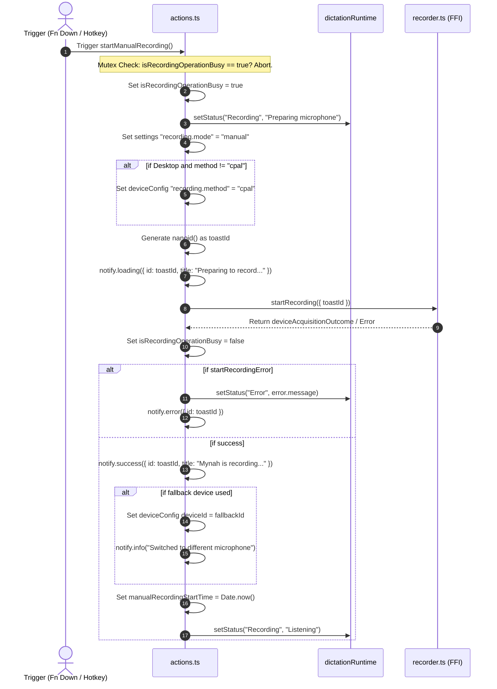
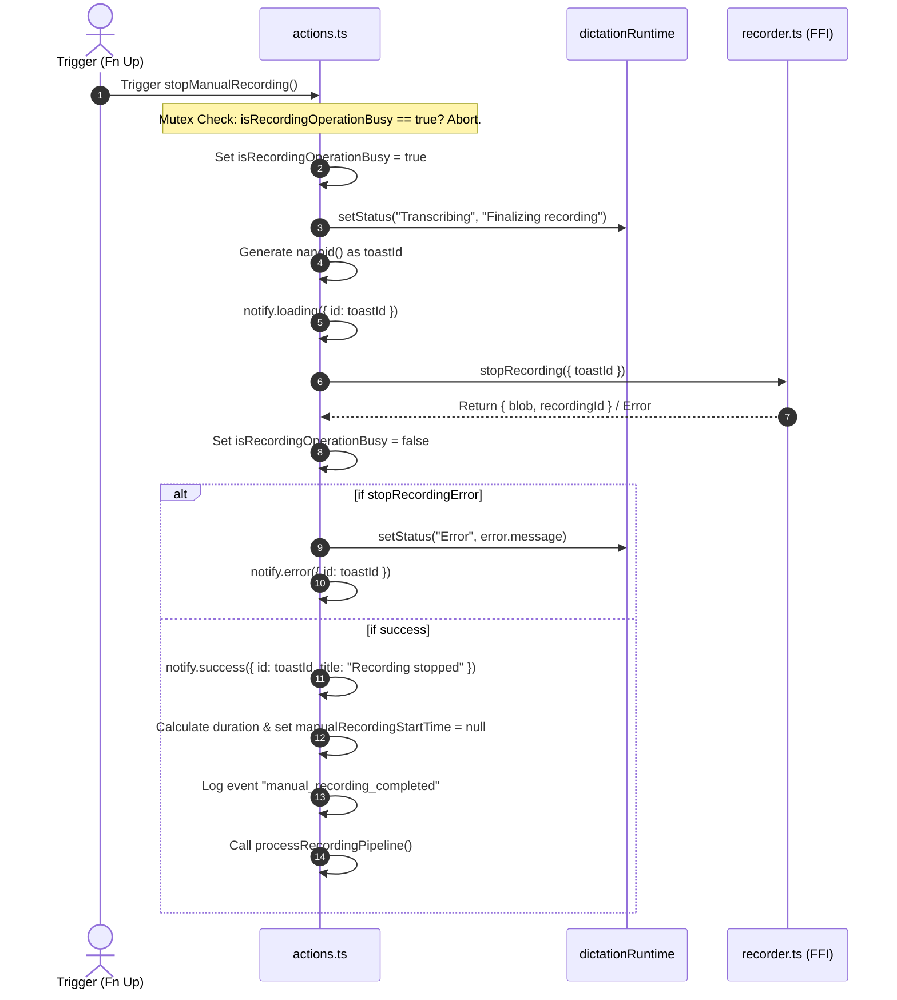
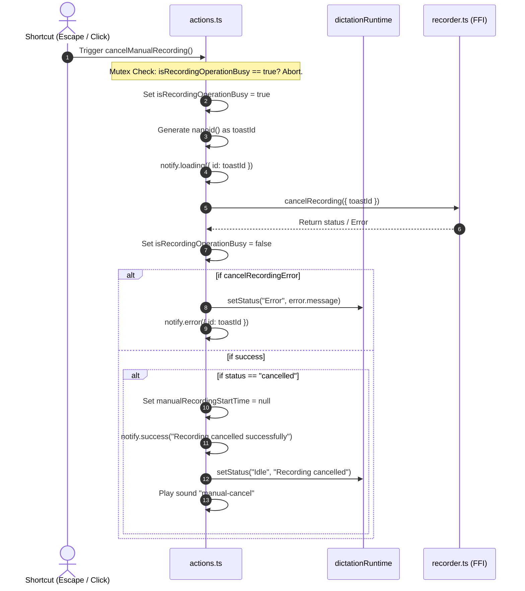
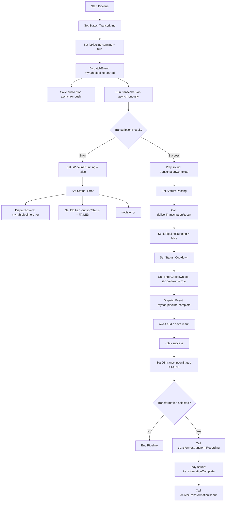
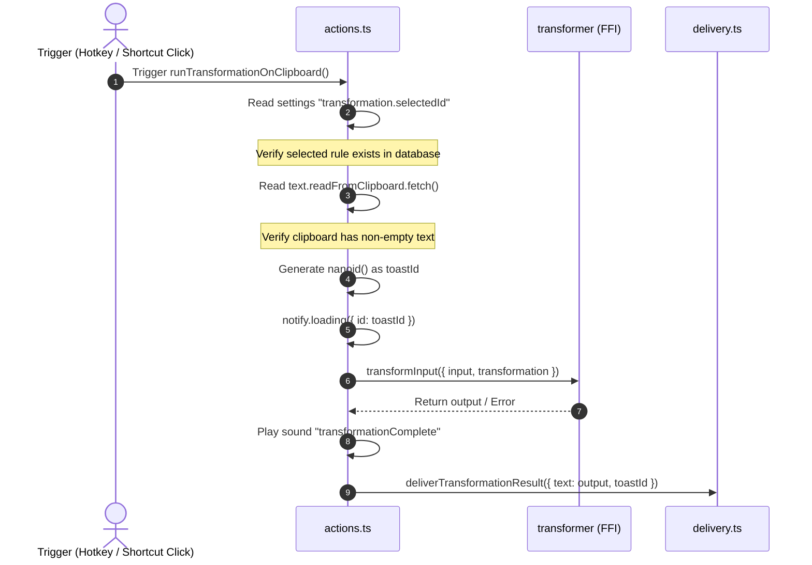

# Mynah Pipeline Side-Effect Map

> Codex review note, 2026-06-04: this AG audit was produced against an older branch/commit snapshot. Treat line numbers and exact event literals as directional only. It remains useful as a side-effect map before any deeper `actions.ts` refactor.

- **Branch**: `local-only-product-surface`
- **Latest Commit Reviewed**: `8366775e57217d2c93319e26c61b1271d0fe11cb`
- **Classification**: Audit only

---

## 1. Overview & Mutex States

The recording and dictation pipeline is managed through `actions.ts` utilizing three module-level state variables that orchestrate access to the hardware recording engine and transcription handlers:
1. `isRecordingOperationBusy` (Mutex flag): Prevents concurrent entry to start/stop/cancel recording commands, avoiding hardware desync during rapid triggers.
2. `isCooldown` (Trigger guard): Blocks new recording activations for **700ms** after paste completes.
3. `isPipelineRunning` (In-flight indicator): Blocks new triggers while transcription or delivery is executing.

---

## 2. Observability Map by Execution Flow

### Flow A: `startManualRecording` (Press to Speak down / Arming)

* **Settings Reads/Writes**:
  * Write: `settings.set('recording.mode', 'manual')` (line 93).
  * Read: `deviceConfig.get('recording.method')` (line 94).
  * Write: `deviceConfig.set('recording.method', 'cpal')` (line 95).
  * Write: `deviceConfig.set('recording.cpal.deviceId', fallbackId)` (line 128-131, if fallback occurs).
* **UI & Notifications**:
  * Loading toast: `notify.loading` (line 99).
  * Success toast: `notify.success` (line 119).
  * Info toast: `notify.info` (line 134 / 148, if device fallback).
* **State Updates**:
  * Write: `dictationRuntime.setStatus` (lines 91, 112, 166).
  * Write: `manualRecordingStartTime = Date.now()` (line 165).

---

### Flow B: `stopManualRecording` (Press to Speak up / Stop)

* **UI & Notifications**:
  * Loading toast: `notify.loading` (line 184).
  * Success toast: `notify.success` (line 206).
* **State Updates**:
  * Write: `dictationRuntime.setStatus` (lines 181, 199).
  * Reset: `manualRecordingStartTime = null` (line 217).
* **Analytics**:
  * Call: `rpc.analytics.logEvent({ type: 'manual_recording_completed', ... })` (line 219).

---

### Flow C: `cancelManualRecording` (Cancel Trigger)

* **State Updates**:
  * Write: `dictationRuntime.setStatus` (lines 470, 492).
  * Reset: `manualRecordingStartTime = null` (line 486).
* **UI & Notifications**:
  * Loading toast: `notify.loading` (line 458).
  * Success/Info toasts: `notify` (lines 476, 487).
* **Audio Cues**:
  * Play: `sound.playSoundIfEnabled('manual-cancel')` (line 493).

---

### Flow D: `processRecordingPipeline` (Inference & Delivery)

This is the most critical flow containing asynchronous operations that must execute sequentially:

* **Detailed Pipeline Stages & Observability Side Effects**:
  1. **Metadata Registration**:
     * Write: `recordings.set(recording)` (line 726) - instantiates a local record in the SQLite/IndexedDB store.
     * Write: `recordings.update(recording.id, { transcriptionStatus: 'TRANSCRIBING' })` (line 727).
  2. **Asynchronous Dispatch**:
     * Write: `isPipelineRunning = true` (line 732).
     * Dispatch: `window.dispatchEvent(new CustomEvent('mynah:pipeline-started'))` (line 734).
     * FFI Call (Async): `services.blobs.audio.save(recording.id, blob)` (line 728).
     * FFI Call (Async): `transcribeBlob(blob)` (line 729).
  3. **Transcription Await**:
     * Read: `settings.get('transcription.service')` (line 105 in `transcription.ts`).
     * Write: `settings.set('transcription.service', 'whispercpp')` (line 113 in `transcription.ts`, if fallback needed).
     * Read: `settings.get('transcription.compressionEnabled')` (line 125).
     * FFI Call (Async): `desktopServices.ffmpeg.compressAudioBlob(...)` (line 127, if compression active).
     * FFI Call (Async): `services.transcriptions.whispercpp.transcribe(...)` (line 173, if whisper engine).
     * Analytics: `rpc.analytics.logEvent({ type: 'transcription_requested' })` (line 118).
     * Analytics: `rpc.analytics.logEvent({ type: 'dictation_timing', stage: 'transcription' })` (line 744).
  4. **Error Gating**:
     * If error occurs:
       * Write: `isPipelineRunning = false` (line 752).
       * Write: `dictationRuntime.setStatus('Error', 'Transcription failed')` (line 753).
       * Dispatch: `window.dispatchEvent(new CustomEvent('mynah:pipeline-error'))` (line 754).
       * Write: `recordings.update(recording.id, { transcriptionStatus: 'FAILED' })` (line 756).
  5. **Text Post-Processing**:
     * Call: `cleanWhisperHallucinations(text)` (line 229 in `transcription.ts`) - sanitizes Whisper repeating text output.
     * Analytics: `rpc.analytics.logEvent({ type: 'transcription_cleanup_applied' })` (line 234).
  6. **Successful Delivery**:
     * Audio: `sound.playSoundIfEnabled('transcriptionComplete')` (line 771).
     * Write: `dictationRuntime.setStatus('Pasting', 'Writing at cursor')` (line 772).
     * FFI Call (Async): `delivery.deliverTranscriptionResult` (line 774).
       * Read settings: `output.transcription.clipboardBehavior` (line 49 in `delivery.ts`).
       * Read settings: `output.transcription.cursor` (line 52).
       * Read settings: `output.transcription.enter` (line 164).
       * FFI Call: `rpc.text.readFromClipboard.fetch()` (line 145, if clipboardBehavior is 'ask').
       * FFI Call: `rpc.text.writeToCursor({ text })` (line 154).
       * FFI Call: `rpc.text.simulateEnterKeystroke()` (line 167, if auto-send return key).
       * FFI Call: `rpc.text.copyToClipboard({ text })` (line 64).
       * UI: `rpc.notify.success` (line 113, delivery toast).
     * Analytics: `rpc.analytics.logEvent({ type: 'dictation_timing', stage: 'delivery' })` (line 786).
     * Analytics: `rpc.analytics.logEvent({ type: 'dictation_timing', stage: 'pipeline' })` (line 792).
  7. **Cooldown Gating**:
     * Write: `isPipelineRunning = false` (line 799).
     * Write: `dictationRuntime.setStatus('Cooldown', 'Ready shortly')` (line 801).
     * Trigger Cooldown: `enterCooldown()` (line 802) -> sets `isCooldown = true`, fires a 700ms timer to set `isCooldown = false`.
     * Trigger Idle: `setTimeout` 700ms (line 804) -> sets `dictationRuntime.setStatus('Idle', 'Ready')`.
     * Dispatch: `window.dispatchEvent(new CustomEvent('mynah:pipeline-complete'))` (line 809).
  8. **Audio Save Synchronization**:
     * Await: `saveAudioPromise` (line 812).
     * Write: `recordings.update(recording.id, { transcript, transcriptionStatus: 'DONE' })` (line 829).
  9. **Chained Text Transformations**:
     * Read settings: `transformation.selectedId` (line 835).
     * If specified and valid:
       * Write: `notify.loading({ id: transformToastId })` (line 857).
       * FFI Call (Async): `transformer.transformRecording({ recordingId, transformation })` (line 864).
       * Audio: `sound.playSoundIfEnabled('transformationComplete')` (line 883).
       * FFI Call (Async): `delivery.deliverTransformationResult` (line 885).
         * Read settings: `output.transformation.clipboard` and `output.transformation.cursor` (lines 363, 375 in `delivery.ts`).
         * FFI Call: `rpc.text.copyToClipboard` and `rpc.text.writeToCursor`.

---

### Flow E: `runTransformationOnClipboard` (Manual Clipboard Shaping)

* **Settings Reads/Writes**:
  * Read: `settings.get('transformation.selectedId')` (line 590).
  * Write: `settings.set('transformation.selectedId', null)` (line 608, if rule no longer in database).
* **UI & Notifications**:
  * Loading toast: `notify.loading` (line 641).
  * Error alerts: `notify.error` (lines 654, 668).
* **Audio Cues**:
  * Play: `sound.playSoundIfEnabled('transformationComplete')` (line 658).
* **FFI Calls**:
  * Read Clipboard: `text.readFromClipboard.fetch()` (line 623).
  * Transform Text: `transformer.transformInput` (line 648).
