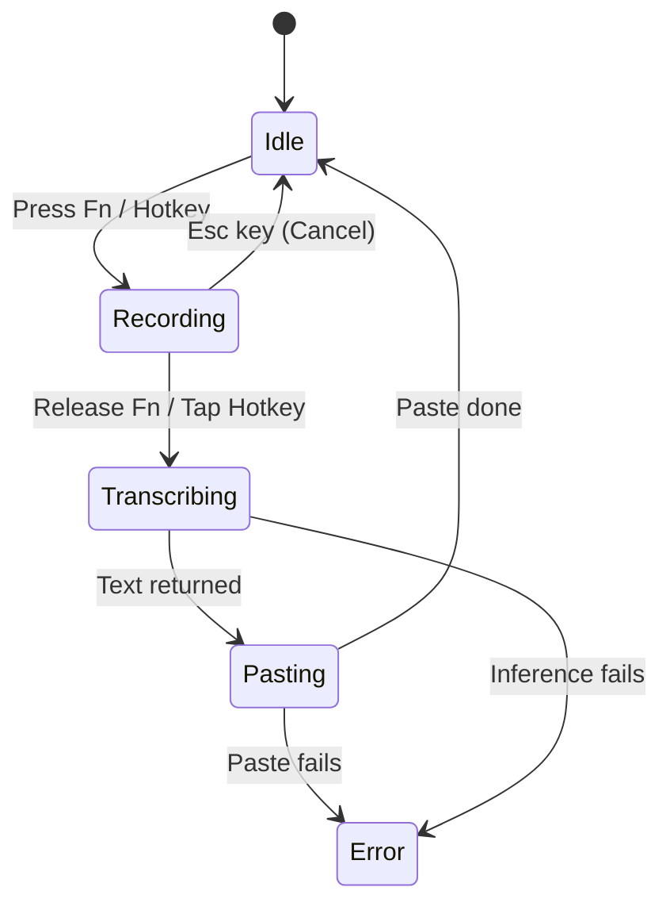

# Architectural Proposal: Backend-Owned Dictation Runtime

**Date**: 2026-06-02  
**Target Version**: `0.2.0` (Native Background Engine)  
**Status**: Architecture Design Proposal  

---

## 1. Executive Summary

Mynah is currently a **local-first** macOS voice typing utility, but its core runtime remains **frontend-dependent**. In the current release, closing the main window hides it instead of destroying the webview. This prevents the global shortcut and `Fn` key listener from going silent, but it is an accidental architectural dependency.

To achieve a true macOS background utility where the webview is *purely a control surface*, we must migrate the dictation lifecycle (hotkey interception, recording streams, whisper.cpp inference, text processing, and paste delivery) entirely into the **Rust backend**.

This proposal outlines the smallest safe path to transition Mynah to a **Rust-owned backend dictation runtime** in a 24–48 hour implementation cycle, ensuring high reliability, zero AppNap sleep issues, and a lightweight background system footprint.

---

## 2. Current vs. Proposed Dependency Maps

### 🔴 Current Architecture (JavaScript-Owned)
The frontend webview acts as the brain, orchestrating system calls back-and-forth across the Tauri bridge:

```text
Hardware Events (Fn Key, Global Hotkeys)
  ↓ (Native Rust CGEventTap / Tauri Global Shortcut)
Emits Tauri Event ("fn-key-down", "fn-key-up")
  ↓ (Svelte WebView)
JavaScript Event Listeners catch events in AppLayout.svelte
  ↓ (JS actions.ts State Machine)
Runs JS Dictation Pipeline
  ├─► Calls recorder.startRecording() (Tauri Command FFI)
  ├─► Calls recorder.stopRecording() (Tauri Command FFI)
  ├─► Awaits audio Blob FFI transfer
  ├─► Calls transcribeBlob() -> whispercpp (Tauri Command FFI)
  ├─► Applies "Text Rules" (JS find/replace)
  ├─► Calls write_text() -> Enigo Paste (Tauri Command FFI)
  └─► Plays chimes (Web Audio API)
```

### 🟢 Proposed Architecture (Rust-Owned)
The Svelte frontend is demoted to a pure subscriber, while the Rust backend owns the system loop:

```text
Hardware Events (Fn Key, Global Hotkeys)
  ↓ (Native Rust CGEventTap / Tauri Global Shortcut)
Rust DictationManager (Native Background Coordinator)
  ↓
Runs Native Rust Dictation Loop
  ├─► Locks RecorderState & runs CPAL capture
  ├─► Writes WAV file to local disk natively
  ├─► Invokes transcription::transcribe_audio_whisper() directly
  ├─► Applies local find-and-replace Text Rules natively
  ├─► Performs Enigo Clipboard Sandwich Paste natively
  ├─► Plays chimes (Rodio audio crate / Native macOS Sound FFI)
  └─► Emits Emitter event ("dictation:state-changed") to Svelte
        ↓
    Svelte WebView (View Only: updates ring/dashboard animations)
```

---

## 3. Dictation Responsibilities & Migration Strategy

### Dictation Responsibilities Today
1. **Shortcut Interception**: Owned by `fn_key_listener.rs` (C FFI event tap) but routed via JS listeners.
2. **State Management**: Owned by JS `actions.ts` (`isRecordingOperationBusy`, `isPipelineRunning`).
3. **Audio Capture**: Initiated by JS calling Rust CPAL commands.
4. **Transcription**: Initiated by JS piping the audio blob back to Rust transcription engines.
5. **Paste Delivery**: Managed by JS calling Enigo clipboard sandwich commands.
6. **Sound Feedback**: Managed by Svelte playing audio files via browser elements.

### Migration Action Plan



#### A. The Rust DictationManager
Create a thread-safe global manager in `dictation_manager.rs` encapsulated in Tauri's managed state:
```rust
pub enum DictationState {
    Idle,
    Recording { start_time: Instant, device: String },
    Transcribing,
    Pasting,
    Error(String),
}

pub struct DictationManager {
    state: Mutex<DictationState>,
    // Thread channels for canceling/stopping tasks
}
```

#### B. The Rust Event Loop
When `fn_key_listener.rs` or the global shortcut detects a trigger, instead of calling `.emit()` to Svelte, it directly locks `DictationManager` and:
1. Starts the CPAL recording session natively using parameters from `device-config` (read via local config JSON).
2. On the stop trigger, stops the CPAL stream, writes the WAV file to disk, and launches a background thread to call `transcription::transcribe_audio_whisper` immediately.
3. Automatically applies deterministic find-and-replace "Text Rules" stored in the local SQLite/Yjs database.
4. Calls the native `write_text` command (Enigo paste sandwich).
5. Emits a single `"dictation:state-changed"` event to Svelte at each stage.

---

## 4. Recommended Rust Command & Event Design

### Tauri Commands (Svelte to Rust)
* `toggle_native_dictation()`: Triggers manually via UI clicking.
* `cancel_native_dictation()`: Aborts the active session instantly.
* `get_native_dictation_state()`: Allows Svelte to poll or sync current state on boot.

### Tauri Events (Rust to Svelte)
* `"dictation:state-changed"`: Emitted on every state transition.
  * *Payload*:
    ```json
    { "status": "Recording", "durationMs": 4200, "inputLevel": 0.45 }
    ```
* `"dictation:success"`: Emitted when a paste completes, containing the finalized text.

---

## 5. File-Level Change List

### 🦀 Tauri Rust Backend
1. **`src-tauri/src/dictation_manager.rs` [NEW]**:
   * Implement `DictationManager` and its background thread state machine.
   * Coordinate CPAL start/stop, WAV serialization, whisper.cpp FFI call, and Enigo clipboard simulation.
2. **`src-tauri/src/lib.rs` [MODIFY]**:
   * Manage `DictationManager` in Tauri's state registry.
   * Set up the system tray and tray menus completely in Rust (`TrayIconBuilder`), executing `dictation_manager` toggles natively on tray click.
   * Intercept `on_window_event` close events to cleanly hide the window without Svelte side-effects.
3. **`src-tauri/src/fn_key_listener.rs` [MODIFY]**:
   * Change callback targets from Svelte `.emit("fn-key-down")` to calling `dictation_manager::start_dictation()` directly in Rust.

### ⚡ Svelte Frontend
1. **`apps/mynah/src/lib/state/dictation.svelte.ts` [NEW]**:
   * A Svelte 5 reactive store that listens to `"dictation:state-changed"` events and exposes `$state` fields (`status`, `inputLevel`, `latestTranscript`) for visualizers.
2. **`apps/mynah/src/routes/(app)/_components/AppLayout.svelte` [MODIFY]**:
   * Remove manual `fn-key-down` event listeners and global shortcuts registers.
   * Hook into the Svelte 5 `dictation` store to drive UI view updates.
3. **`apps/mynah/src/lib/services/desktop/tray.ts` [DELETE]**:
   * Delete this file entirely as the system tray is now managed 100% natively in Rust.

---

## 6. Test Plan

### Phase A: Native Pipeline Verification
* Verify that starting recording, capturing audio via CPAL, transcribing, and pasting operates perfectly with the webview **completely closed/destroyed** (by terminating the Svelte webview via devtools or running a headless Tauri configuration).

### Phase B: Svelte Reaction Checks
* Verify that Svelte accurately renders status transitions (*Ready -> Listening -> Transcribing -> Pasted*) on the Control Center dashboard when triggered via the hardware `Fn` key.

---

## 7. Risks & Rollback Strategy

### ⚠️ Risks
1. **WebView Lifecycle Sync**: If Svelte is destroyed, how do we load and persist user settings (e.g. active Whisper model path)?
   * *Mitigation*: Rust must read and write settings directly to a shared `settings.json` file in `Application Support` instead of relying on browser `localStorage`.
2. **Permissions Revocation**:
   * *Mitigation*: Rust must verify Accessibility and Microphone trusted states before launching `DictationManager` and throw native macOS notifications if they are missing.

### ↩️ Rollback Criteria
* If CPAL native capture or Enigo pasting shows concurrency locks in pure Rust, roll back to Svelte hide-on-close (`e4f6dd4`) which preserves the working JS pipeline while maintaining menu-bar visibility.
