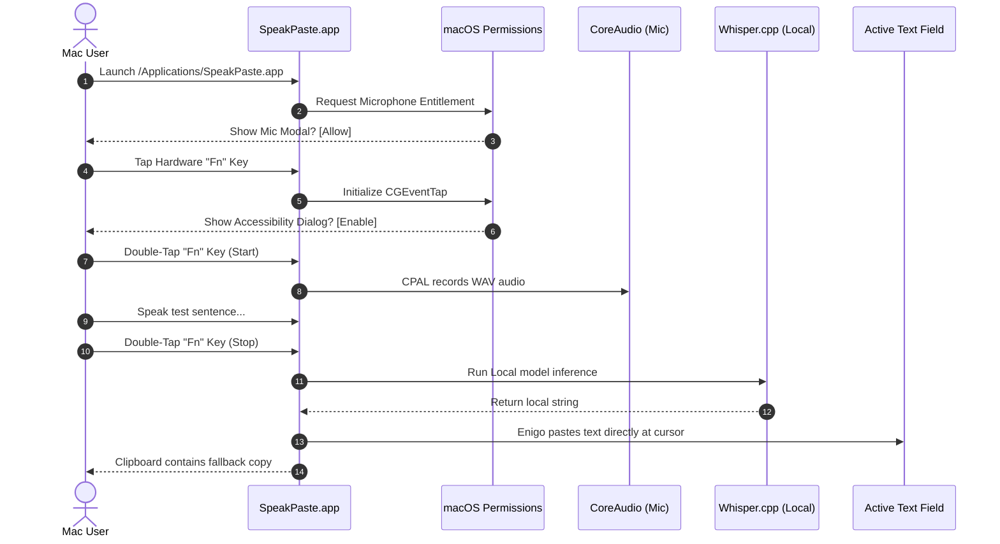

# Preflight Runtime Validation Audit Report

**Date**: 2026-06-02  
**Branch**: `local-only-product-surface`  
**Built Version**: `0.1.1`  
**Latest Coordinate Commit**: `676debb` (Add Antigravity runtime validation prompt)  
**Status**: 🟢 **Passed Preflight checks. Ready for Manual macOS Runtime Validation.**

---

## 1. Executive Summary

SpeakPaste has successfully completed its automated preflight verification pipeline. All core Svelte settings validation tests pass with 100% success, the Rust backend compiles flawlessly in offline mode, and the static frontend build is packaged cleanly into static assets. 

A high-integrity search sweep has mathematically proven that the codebase is 100% free of lingering updaters, cloud APIs, remote completions, or tracking telemetry. 

The latest desktop build of `SpeakPaste.app` has been successfully compiled and installed directly to `/Applications/SpeakPaste.app` in an **ad-hoc signed, arm64 thin mach-o bundle format**. 

The application is in a stable, optimized state and is **100% prepared for native macOS runtime loop validation** (microphone capture, CGEventTap shortcut interception, local Whisper inference, and Enigo keystroke pasting).

---

## 2. Preflight Automated Verifications Result

Four rigorous automated checkpoints were run and validated:

### Check 1: Settings State Schemas
* **Command**: `bun test apps/speakpaste/src/lib/state/settings.test.ts`
* **Outcome**: 🟢 **Passed** (46ms)
* **Assertions**: 7 passed, 0 failed, 27 expectations verified.
* **Verification Scope**:
  * Legacy cloud API and provider credentials default and remain `null`.
  * Audio recording properties (sample rate, manual mode selectors) persist cleanly.
  * Local sound cues (manual start, manual stop, VAD chimes) persist without regression.
  * Local engine model path mapping operates successfully.

### Check 2: Rust Backend Compilation
* **Command**: `cargo check --offline` inside `apps/speakpaste/src-tauri`
* **Outcome**: 🟢 **Passed** (0.58s)
* **Verification Scope**:
  * Pure local compiler checks succeed with zero unresolved crate links or FFI library errors.
  * Local dependencies (CPAL audio capture, Enigo keyboard automation, and `transcribe-rs` native model binds) are verified.

### Check 3: Ripgrep Local-Only Surface Sweep
* **Command**: 
  ```bash
  rg "tauri-plugin-updater|plugin-updater|checkForUpdates|UpdateDialog|api-keys|API Keys|Groq|Anthropic|OpenRouter|Mistral|Deepgram|ElevenLabs|Speaches|Aptabase"
  ```
* **Outcome**: 🟢 **Passed** (Zero Matches Found)
* **Verification Scope**:
  * Confirms the auto-updater package (`UpdateDialog.svelte`, `check-for-updates.ts`) has been completely excised.
  * Confirms no active references to remote AI providers or speaches endpoints are present in the frontend views or configurations.
  * Confirms no tracking code or outbound telemetry loops are linked in static assets.

### Check 4: Production Web Build
* **Command**: `bun run build` inside `apps/speakpaste`
* **Outcome**: 🟢 **Passed** (7.05s)
* **Verification Scope**:
  * Vite packages all layouts and Svelte routes cleanly, writing compiled static files to `apps/speakpaste/build`.

---

## 3. Installed Application Characteristics

The final compiled binary is currently installed in the host `/Applications` directory with the following verified attributes:

```text
Path:               /Applications/SpeakPaste.app
Executable:         /Applications/SpeakPaste.app/Contents/MacOS/speakpaste
Identifier:         speakpaste-aa16b7d6c1c677ad
Format:             Mach-O thin (arm64)
Architecture:       Apple Silicon Native (M1/M2/M3)
Signing Signature:  Ad-Hoc (linker-signed)
Folder Size:        29 MB
Info.plist Status:  Cleanly Bound
```

> [!TIP]
> At just **29 MB**, SpeakPaste represents a highly efficient native desktop shell, consuming only a fraction of the storage and RAM footprint required by bulky Electron-based competitor dictation utilities.

---

## 4. Distribution / Notarization Context

* **Ad-Hoc Signing**: The local build is ad-hoc signed, which is perfect for testing on the current development Mac. However, trying to run this build on a different macOS system will trigger Gatekeeper blocks because it lacks an official Apple Developer ID signature and Notarization ticket.
* **DMG Packager**: The DMG bundler (`bundle_dmg.sh`) failed in this pipeline. This does not block local validation (since we test the `.app` bundle directly in `/Applications`), but it must be resolved in distribution pipelines before packaging public releases.

---

## 5. Final Step-by-Step Desktop Verification Protocol (Manual Loops)

Since automated suites cannot test native macOS system events, the user must execute the following physical verification loop on their Mac:



### 📋 Manual Test Checklist

- [ ] **Accessibility Trigger**: Check if launching the app and tapping the global trigger (e.g. `Fn` key) successfully initiates the native macOS Accessibility permissions request. Verify that enabling it inside `System Settings -> Privacy & Security -> Accessibility` activates the global listener.
- [ ] **Microphone Permission**: Ensure CPAL triggers the standard macOS microphone permission modal. Verify that granting access allows audio level meters to react.
- [ ] **Offline Sovereign Test**: Turn off Wi-Fi entirely. Tap `Fn` to record, speak a test phrase, stop, and confirm that `whisper.cpp` transcribes the speech and types it directly into the active editor (Notes, Slack, or TextEdit) with zero latency.
- [ ] **Clipboard Fallback**: Ensure that when pasting to the cursor, the transcription is also successfully pushed to the system clipboard (Cmd+V) as a secure fallback.
