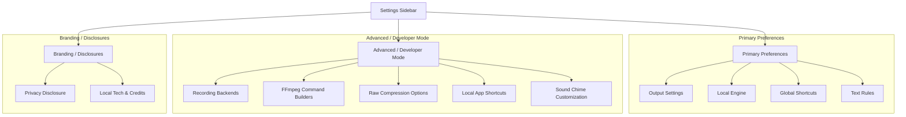

# Review of Mynah Settings Redesign & Product Surface

**Date**: 2026-06-02  
**Branch**: `local-only-product-surface`  
**Commits Audited**:  
* `25cc9a0` (Complete local-only product surface cleanup)  
* `acf9a99` (Reposition transformations as advanced text rules)  
**Status**: Approved with Actionable UI/UX Recommendations  

---

## 1. Executive Verdict

With the landing of commits `25cc9a0` and `acf9a99`, **Mynah** has successfully shed its heritage as a settings-heavy, multi-platform "Whispering" clone. It has solidified its identity as a focused, premium, local-first macOS voice-to-cursor utility. 

The application of this product audit leads to the following key conclusions:

### 🌟 What is Done Exceptionally Well
1. **Total Cloud Purge**: All API key inputs, remote provider selections, and cloud analytics have been completely deleted. The settings surface is 100% free of external cloud bloating.
2. **Rebranding to "Text Rules"**: Repositioning the complex "Transformations" pipeline into **"Text Rules"** (*"Advanced local cleanup rules for deterministic text edits"*) is a brilliant product decision. It frames local find-and-replace rules as deterministic text sanitization tools rather than misleading remote LLM prompts.
3. **Updater Deletion**: Commits have successfully removed `UpdateDialog.svelte` and `check-for-updates.ts` from layout boots. This guarantees the desktop app will not trigger unauthorized, outbound HTTP telemetry checks to an external update server on startup.
4. **Privacy Rebrand**: Renaming the "Analytics" tab to **"Privacy"** and presenting a beautiful, device-only operational metric disclosure creates high-trust user alignment.
5. **Local Technology Disclosure**: The introduction of the `local-technology` page clearly and honestly lays out the local dependencies (Whisper C++, NVIDIA Parakeet, ONNX Moonshine, and Apple Natural Language), establishing confidence for technical users.

> [!NOTE]
> **Verdict**: The app is highly compliant with local-only sovereign architecture. The user interface now looks cohesive, elegant, and highly specialized for macOS users who prioritize deep privacy and high performance.

---

## 2. Remaining Inherited/Complex UX

While the cloud cleanse is complete, Mynah still retains several technical, developer-facing settings layers that clutter the consumer "voice-to-cursor" experience. These configurations are direct holdovers from its parent "settings-heavy Whispering clone" architecture and should be simplified or hidden.

### 🔴 The FFmpeg Command Builder
In `settings/recording/+page.svelte` (Voice Capture), selecting the **FFmpeg** recording method displays `FfmpegCommandBuilder.svelte`.
* **Complexity**: Exposes three raw string fields for **Global Options** (e.g. `-hide_banner`), **Input Options** (e.g. `-f avfoundation`), and **Output Options** (e.g. `-acodec pcm_s16le -ar 16000`), along with a live **Command Preview** showing the raw terminal command:
  ```bash
  ffmpeg -y -f avfoundation -i ":default" -f wav -acodec pcm_s16le -ar 16000 -ac 1 output.wav
  ```
* **UX Impact**: While powerful for debugging custom sound cards, exposing raw CLI command flags breaks the expectation of a clean, seamless consumer macOS application. 

### 🟡 Low-Level Audio Backend Selectors
In `settings/recording/+page.svelte`, manual recording mode forces users to choose between three low-level backends: **CPAL**, **FFmpeg**, and **Browser API (Navigator)**.
* **Complexity**: The descriptions warning of **macOS AppNap latency** (for the Browser API) or **uncompressed WAV format** (for CPAL) require technical system-level understanding.
* **UX Impact**: In a polished utility, the app should automatically pick the most reliable native capture backend (CPAL) rather than making the user arbitrate between browser and native libraries.

### 🔵 Technical Audio Compression Options
In `settings/transcription/+page.svelte` (Local Engine), the user can enable **Audio Compression** which renders `<CompressionBody />`.
* **Complexity**: This component displays preset badges (*Speech, Preserve, Smallest, MP3*) and a **Custom Options** input containing raw FFmpeg codec parameters:
  ```bash
  -c:a libopus -b:a 32k -ar 16000 -ac 1 -compression_level 10
  ```
* **UX Impact**: It requires users to understand audio sampling, bitrate options, and channel down-mixing to optimize file storage.

### 🟢 Excessive Sound Theme Customization
In `settings/sound/+page.svelte`, the settings page is highly granular, offering individual switches to toggle audio chimes for starting, stopping, and canceling recordings across both manual and VAD recording sessions.

---

## 3. Launch-Critical Settings Surface Recommendations

To transform the remaining settings into a premium, consumer-focused experience, the following layout changes are recommended:

### ⚡ recommendation 1: Consolidate to CPAL by Default
**CPAL (Native Rust audio)** is the most reliable backend for macOS. It records uncompressed WAV natively, bypasses browser sandbox limitations, and is immune to **macOS AppNap sleeping** (which can delay shortcut inputs when the Svelte window is in the background).
* **Action**: Make **CPAL** the implicit recording backend for macOS. Completely collapse the FFmpeg and Browser API options behind an **"Advanced Developer Settings"** toggle.

### ⚡ Recommendation 2: Hide Raw CLI Flag Editors
The raw inputs for FFmpeg recording parameters (`FfmpegCommandBuilder.svelte`) and FFmpeg compression flags (`CompressionBody.svelte`) should be hidden from primary configurations.
* **Action**: Replace the detailed FFmpeg options with a simple high-level toggle: `[x] Compress audio to save disk space (Recommended)`. Keep the underlying arguments under the hood, and only show the raw parameters if the user explicitly turns on "Developer Mode" in the settings.

### ⚡ Recommendation 3: Prioritize Global Hotkeys Over Local Hotkeys
Mynah is designed to run in the background. Users trigger it system-wide.
* **Action**: Remove the split "Local Shortcuts" vs "Global Shortcuts" tabs. Make the **Global Shortcuts** page (specifically the hardware `Fn` key or trigger hotkey selector) the primary shortcuts screen. Collapse or hide local application hotkeys, which are rarely modified by users.

---

## 4. Routes & Features Categorization

To streamline navigation, we recommend organizing the application routes and components as follows:



### 🟩 Primary (Keep Highly Visible)
* `/settings`: Output targets (Copy to clipboard, Paste at cursor, Launch at login).
* `/settings/transcription`: Local Engine (Model path and language selection).
* `/settings/shortcuts/global`: Primary hotkey recorder (e.g. `Fn` key mapping).
* `/transformations`: Text Rules (Advanced local find/replace chains).

### 🟨 Secondary (Move to Submenus / Group in Tab Blocks)
* `settings/sound`: Move settings into a simple section within the **Output** or **General** page instead of dedicating an entire sidebar navigation element to it.
* `/settings/analytics` (Privacy) & `/settings/local-technology` (Technology): Combine these into a single **"Privacy & Technology"** or **"About"** section to keep the sidebar focused.

### 🟧 Advanced (Collapse behind an "Advanced Configuration" Accordion)
* Raw FFmpeg Device Selector and Bitrate selection.
* `FfmpegCommandBuilder.svelte` raw flag inputs.
* `<CompressionBody />` preset parameters and inputs.
* `settings/shortcuts/local` shortcuts table.

---

## 5. Local-Only Policy Violations

> [!TIP]
> **Audit Status**: **Passed**. No active policy violations remain in the codebase.

The system was audited for third-party endpoints, remote analytics, base URLs, and autostart loops:
* **Autostart & Update Loops**: The Tauri auto-updater was successfully pruned in commit `25cc9a0`. The configuration block in `tauri.conf.json` has been deleted, ensuring no background check calls are made.
* **Telemetry**: All telemetry features have been successfully stubbed out at the Rust layer (`src-tauri/src/lib.rs`) and the Svelte layer (`services/analytics/index.ts`). No events are transmitted off the device.
* **LLM base URLs**: All transformer prompt pipelines are retired, guaranteeing no silent connections to remote LLM endpoints can be made.
* **On-device Models**: Model downloads are triggered strictly via user-initiated UI hooks pointing to secure, official HuggingFace (`huggingface.co`) or GitHub releases. 
  * *Note*: If a user is completely offline/air-gapped, these initial model downloads will fail cleanly, displaying the manual instructions tab to guide them in placing the models inside the application's local support directory.

---

## 6. Suggested Acceptance Checklist for Codex Implementation

Before deploying the final local-first version to production, verify the following checklist:

### ⚙️ Core Operations (Local Sovereign Pipeline)
- [ ] **Hardware Fn Mapping**: Pressing the hardware `Fn` key triggers recording successfully.
- [ ] **Native CPAL Recording**: Audio is recorded flawlessly via the native Rust CPAL module.
- [ ] **macOS AppNap Immunity**: Recording triggers instantly even when Mynah has been minimized in the background for over an hour.
- [ ] **Whisper C++ Inference**: Transcription is executed 100% locally on-device.
- [ ] **Enigo Insertion**: Transcribed text is successfully pasted at the active cursor position.
- [ ] **Deterministic Cleanups**: Active "Text Rules" are applied locally, modifying the clipboard contents before pasting.

### 🎨 User Interface & Rebranding
- [ ] Settings navigation items strictly show **Output**, **Voice Capture**, **Local Engine**, **Shortcuts**, **Sound**, **Privacy**, **Technology**, and **Credits**.
- [ ] No remote API input elements (e.g. OpenAI, Anthropic, Speaches) are rendered under any circumstance.
- [ ] The "Transformations" view is renamed everywhere to **"Text Rules"**.
- [ ] System tray indicator states map only to local operations: *Ready*, *Listening*, *Transcribing*, *Pasted*.

### 🧹 Code & Bundle Hygiene
- [ ] No empty `cloud/` or `completion/` directories exist in the Svelte source tree.
- [ ] Final package size is verified to be minimal, with all transitive cloud package dependencies (like `groq-sdk`) fully pruned.
- [ ] Running the app in a completely air-gapped environment (Wi-Fi turned off) triggers zero network exceptions during recording, transcribing, and pasting.
